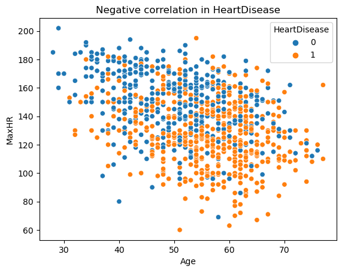
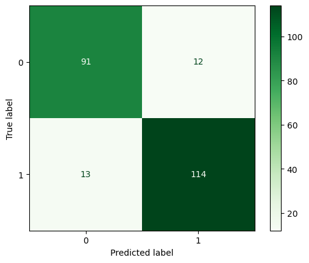

# Heart Disease
An analysis to confirm if a person is likely to suffer from heart diesease

**Author**: Dustin W

### Business problem:

Cardiovascular diseases are the leading cause of death globally. By early detection and management of people with Cardiovascular diseases can save their life.

### Data:

## Methods
- AdaBoost
- LightGBM
- XGBoost

## Results

#### Heatmap of all numeric columns in dataset

> The heatmap above shows there is a positive correlation between HeartDisease and Oldpeak.

> The heatmap above shows there is a negative correlation between MaxHr and HeartDisease.

#### Scatterplot of HeartDisease and MaxHR

> In the 'Negative correlation in HeartDisease' visual, we see that as an individual's age increases, their MaxHR decreases and makes them more likely to have HeartDisease.

## Model

- LightGBM was my best model. An accuracy score of .89 and recall and percision is .90.
 

## Recommendations:

I recommend using the LightGBM model to predict likelihood of detecting an individual with heart disease.

For any additional questions, please provide a comment.
