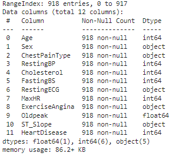
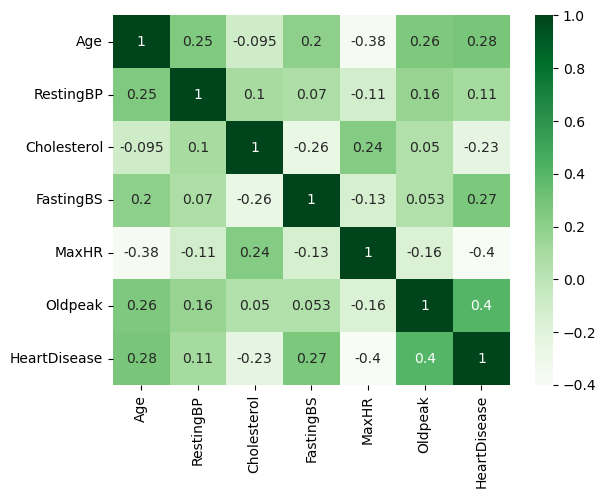

# Heart Disease
An analysis to confirm if a person is likely to suffer from heart diesease

**Author**: Dustin W

### Business problem:

Cardiovascular diseases are the leading cause of death globally. By early detection and management of people with Cardiovascular diseases can save their life.

### Data:

## Methods
- AdaBoost
- LightGBM
- XGBoost

## Results

#### Heatmap of all numeric columns in dataset

> The heatmap above shows there is a positive correlation between HeartDisease and Oldpeak.

> The heatmap above shows there is a negative correlation between MaxHr and HeartDisease.

#### Scatterplot of MRP and Item Outlet Sales

> To expand further on the correlation mentioned above, the scatter plot below confirms that as Item_MRP increases, so does Item_Outlet_Sales. This is an example of a positive correlation.
## Model

- Linear Regression Model (Testing Set):
  - R^2: -6.835227208182029e+23
  - RMSE: 1373252949182061.8

- Decision Tree Regressor Model (Testing Set):
  - R^2: 0.5960564372160062
  - RMSE: 1373252949182061.8

## Recommendations:

I recommend using the Regression Tree Model to predict sales. The R2 score for the training and testing data is about .6. The model can explain 60% of the variation in the target for the training and testing datasets.

For any additional questions, please provide a comment.
